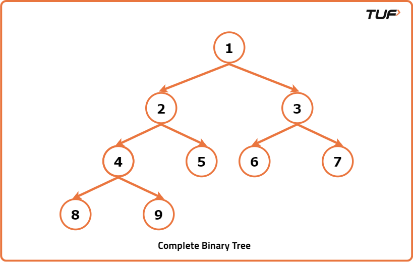
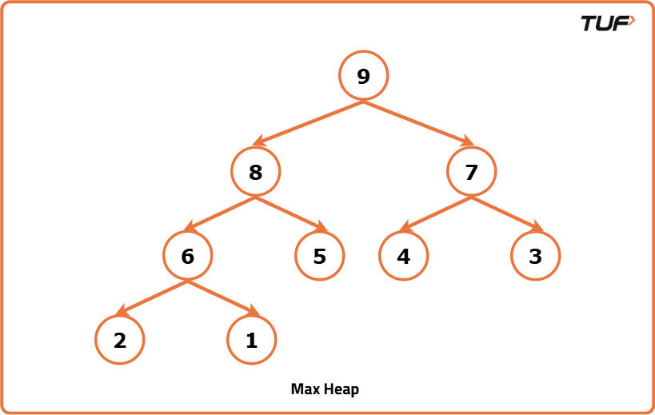
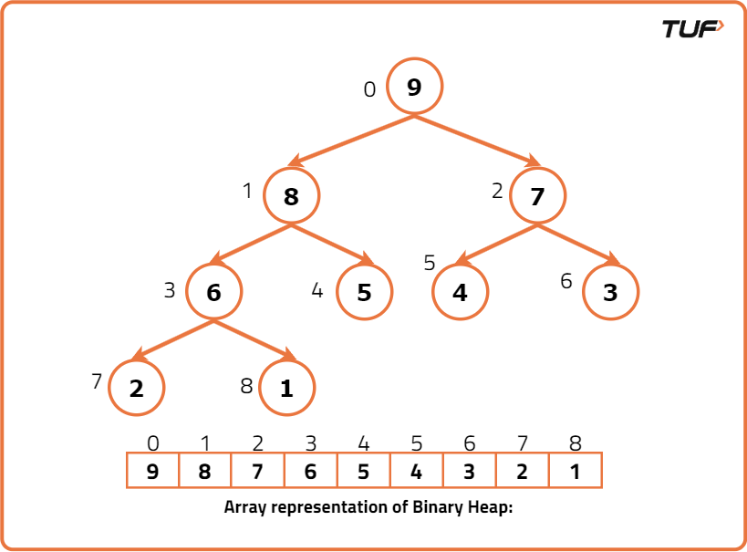

# Binary Heap

A **Binary Heap** is a special type of **Binary Tree** that satisfies the following conditions:

- It should be a **Complete Binary Tree**
- It should satisfy the **Heap Property**

---

## Complete Binary Tree

A **Complete Binary Tree** is a binary tree in which:

- All levels are completely filled except possibly the last level.
- The last level is filled from **left to right** as much as possible.

Example:



---

## Heap Property

A Binary Heap can be either:

- **Min Heap**
- **Max Heap**

The heap property determines the type of heap.

---

### Min Heap Property

In a **Min Heap**, the value of every parent node is **less than or equal to** the values of its children.

Therefore:

- The smallest element is always at the **root**.
- Every subtree also follows the Min Heap property.

Example:


---

### Max Heap Property

In a **Max Heap**, the value of every parent node is **greater than or equal to** the values of its children.

Therefore:

- The largest element is always at the **root**.
- Every subtree also follows the Max Heap property.

Example:



---

# Representation of a Binary Heap

A Binary Heap is generally represented using an **array**.

- The root element is stored at `arr[0]`.

The relationship between parent and child indices is shown below:

| Node Index `i` | Left Child Index | Right Child Index |
|----------------|------------------|-------------------|
| `i`            | `2*i + 1`        | `2*i + 2`         |

If a node is at index `i`, then its parent index is:

| Child Index | Parent Index |
|-------------|---------------|
| `i`         | `(i - 1) / 2` |

Example Representation:



---

# Operations Associated with Min Heap

Common operations performed on a Min Heap are:

- `insert()`
- `heapify()`
- `getMin()`
- `extractMin()`
- `delete()`
- `decreaseKey()`

> **Note:**  
> A Binary Heap must always:
> - remain a **Complete Binary Tree**
> - satisfy the appropriate **Heap Property** (Min Heap or Max Heap)
>
> If any operation violates these conditions, the heap must be rearranged to restore them.

---

## Insert()

The `Insert()` operation inserts a new key into the Binary Heap.

### Steps Followed for Inserting a Key into Binary Heap

1. Insert the key at the first vacant position from the left on the last level of the heap.
2. If the last level is completely filled, insert the key as the left-most element in the next level.
3. Inserting at the first vacant position preserves the **Complete Binary Tree** property.
4. However, the **Min Heap Property** may get violated.
5. Compare the inserted key with its parent:
   - If the parent is smaller, the Min Heap property is satisfied.
   - Otherwise, swap the parent and child.
6. Repeat the process until the Min Heap property is restored.

### Time Complexity

| Operation | Time Complexity |
|-----------|-----------------|
| Insert()  | `O(logN)` |

---

## Heapify()

Suppose there exists a node at some index `i` where the Min Heap property is violated.

We assume that all subtrees rooted at the children of index `i` are already valid Min Heaps.

The `Heapify()` function restores the Min Heap property.

### Steps Followed for Heapify

1. Find the minimum among:
   - Current node
   - Left child
   - Right child
2. If the minimum is the left child:
   - Swap with the left child.
   - Recursively call `Heapify()` on the left child.
3. If the minimum is the right child:
   - Swap with the right child.
   - Recursively call `Heapify()` on the right child.
4. Stop recursion when the Min Heap property is satisfied.

### Time Complexity

| Operation | Time Complexity |
|-----------|-----------------|
| Heapify() | `O(logN)` |

---

## getMin()

The `getMin()` operation returns the minimum element from the heap.

Since the root node always contains the minimum value in a Min Heap:

```cpp
return arr[0];
```

### Time Complexity

| Operation | Time Complexity |
|-----------|-----------------|
| getMin()  | `O(1)` |

---

## ExtractMin()

The `ExtractMin()` operation removes the minimum element (root node) from the Min Heap.

### Steps Followed for ExtractMin()

1. Copy the last node value to the root node.
2. Decrease the heap size by `1`.
3. This preserves the **Complete Binary Tree** property.
4. However, the Min Heap property may get violated.
5. Call `Heapify()` on the root node to restore the Min Heap.

### Time Complexity

| Operation    | Time Complexity |
|-------------|-----------------|
| ExtractMin() | `O(logN)` |

---

## DecreaseKey()

Given an index and a smaller value, update the value at that index.

### Steps Followed for DecreaseKey()

1. Let:
   - Index = `i`
   - New value = `new_val`
2. Update:

```cpp
arr[i] = new_val;
```

3. The Complete Binary Tree property remains valid.
4. The Min Heap property may get violated with ancestors.
5. Compare the node with its parent:
   - If parent is greater, swap them.
6. Repeat until the Min Heap property is restored.

### Time Complexity

| Operation      | Time Complexity |
|---------------|-----------------|
| DecreaseKey() | `O(logN)` |

---

## Delete()

Given an index, delete the value at that index from the Min Heap.

### Steps Followed for Delete()

1. Update the value at the given index with `INT_MIN`.
2. Call `DecreaseKey()` so that the node moves to the root.
3. Call `ExtractMin()` to remove the root node.

This effectively deletes the desired element from the heap.

### Time Complexity

| Operation | Time Complexity |
|-----------|-----------------|
| Delete()  | `O(logN)` |

---

# C++ Implementation of Min Heap

```cpp
#include <bits/stdc++.h>
using namespace std;

class BinaryHeap {
public:
    int capacity;
    int size;
    int* arr;

    BinaryHeap(int cap) {
        capacity = cap;
        size = 0;
        arr = new int[capacity];
    }

    // Parent index
    int parent(int i) {
        return (i - 1) / 2;
    }

    // Left child index
    int left(int i) {
        return 2 * i + 1;
    }

    // Right child index
    int right(int i) {
        return 2 * i + 2;
    }

    // Insert a new key
    void Insert(int x) {
        if (size == capacity) {
            cout << "Binary Heap Overflow" << endl;
            return;
        }

        arr[size] = x;
        int k = size;
        size++;

        while (k != 0 && arr[parent(k)] > arr[k]) {
            swap(&arr[parent(k)], &arr[k]);
            k = parent(k);
        }
    }

    // Heapify function
    void Heapify(int ind) {
        int li = left(ind);
        int ri = right(ind);
        int smallest = ind;

        if (li < size && arr[li] < arr[smallest])
            smallest = li;

        if (ri < size && arr[ri] < arr[smallest])
            smallest = ri;

        if (smallest != ind) {
            swap(&arr[ind], &arr[smallest]);
            Heapify(smallest);
        }
    }

    // Return minimum element
    int getMin() {
        return arr[0];
    }

    // Remove minimum element
    int ExtractMin() {
        if (size <= 0)
            return INT_MAX;

        if (size == 1) {
            size--;
            return arr[0];
        }

        int mini = arr[0];

        arr[0] = arr[size - 1];
        size--;

        Heapify(0);

        return mini;
    }

    // Decrease key value
    void Decreasekey(int i, int val) {
        arr[i] = val;

        while (i != 0 && arr[parent(i)] > arr[i]) {
            swap(&arr[parent(i)], &arr[i]);
            i = parent(i);
        }
    }

    // Delete key
    void Delete(int i) {
        Decreasekey(i, INT_MIN);
        ExtractMin();
    }

    // Swap helper function
    void swap(int* x, int* y) {
        int temp = *x;
        *x = *y;
        *y = temp;
    }

    // Print heap
    void print() {
        for (int i = 0; i < size; i++)
            cout << arr[i] << " ";
        cout << endl;
    }
};

int main() {
    BinaryHeap h(20);

    h.Insert(4);
    h.Insert(1);
    h.Insert(2);
    h.Insert(6);
    h.Insert(7);
    h.Insert(3);
    h.Insert(8);
    h.Insert(5);

    cout << "Min value is " << h.getMin() << endl;

    h.Insert(-1);
    cout << "Min value is " << h.getMin() << endl;

    h.Decreasekey(3, -2);
    cout << "Min value is " << h.getMin() << endl;

    h.ExtractMin();
    cout << "Min value is " << h.getMin() << endl;

    h.Delete(0);
    cout << "Min value is " << h.getMin() << endl;

    return 0;
}
```

---

# Time Complexities

| Function        | Time Complexity |
|----------------|-----------------|
| Insert()       | `O(logN)` |
| Heapify()      | `O(logN)` |
| getMin()       | `O(1)` |
| ExtractMin()   | `O(logN)` |
| DecreaseKey()  | `O(logN)` |
| Delete()       | `O(logN)` |

# What is a Priority Queue?

A **Priority Queue** is a special type of queue in which each element is assigned a **priority**.

Unlike a normal queue (FIFO), elements are processed based on priority:

- The element with the **highest priority** is removed first.
- If two elements have the same priority, they are processed according to their insertion order.

## Real-Life Example

Consider an emergency room in a hospital:

- Patients are not treated based only on arrival time.
- A patient with a heart attack is treated before someone with a mild cold.

This behavior is similar to a Priority Queue.

## Applications of Priority Queue

Priority Queues are widely used in:

- Task Scheduling
- Dijkstra’s Shortest Path Algorithm
- Operating Systems
- Event-driven Simulations
- Real-time Systems