# Introduction to Trees

In the world of data structures and algorithms, understanding **Binary Trees** lays the groundwork for hierarchical organization and efficient data manipulation.

Up until now, we have studied **arrays, linked lists, stacks, and queues**, which are fundamental linear data structures. Binary Trees are a different type of data structure that organize information hierarchically instead of linearly. They resemble a tree with branching nodes, making them ideal for representing multi-level relationships.

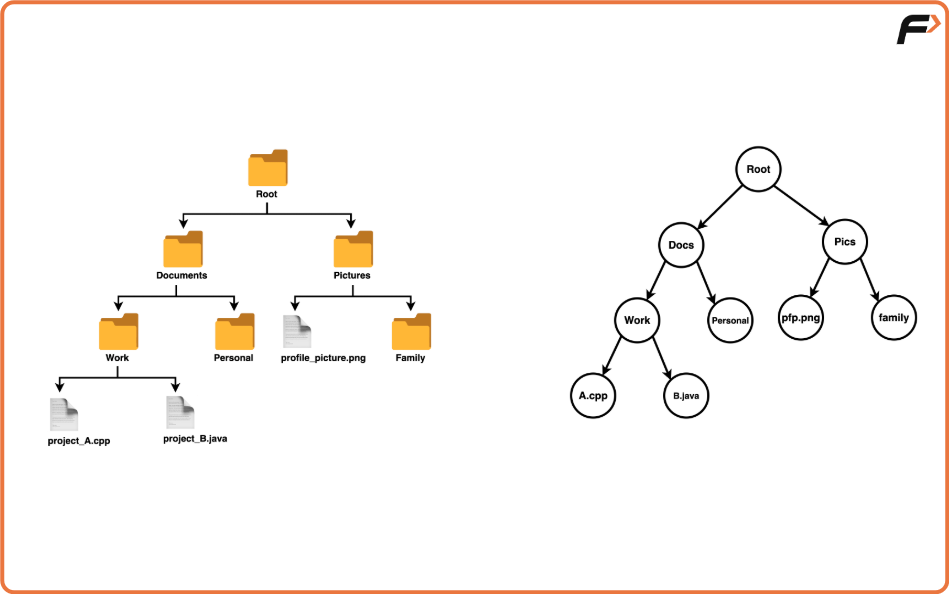

Just as folders, subfolders, and files are hierarchically arranged in a computer's file system, a binary tree has a similar structure where nodes represent folders and child nodes represent subdirectories or files.

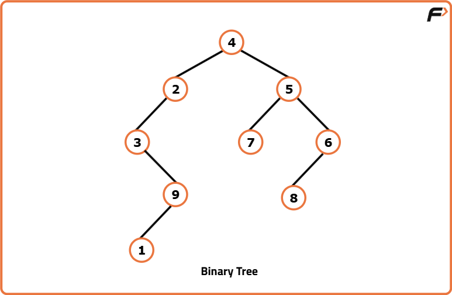

---

# Binary Tree

A **Binary Tree** is a fundamental hierarchical data structure in computer science that consists of nodes arranged in a tree-like structure. Each node can have **at most two children**, known as the **left child** and the **right child**.

## Nodes

Each node in a binary tree contains:

- A piece of data (called the node's **value** or **key**)
- A pointer/reference to its **left child**
- A pointer/reference to its **right child**

These references allow traversal from one node to another in a hierarchical manner.

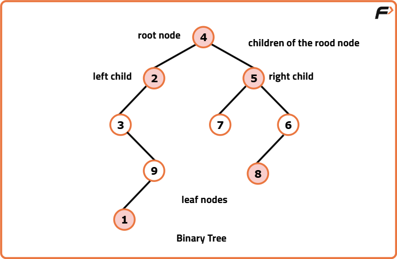

---

## Root Node

The **Root Node** is the topmost node of a binary tree from which all other nodes originate. It serves as the entry point for traversing the tree.

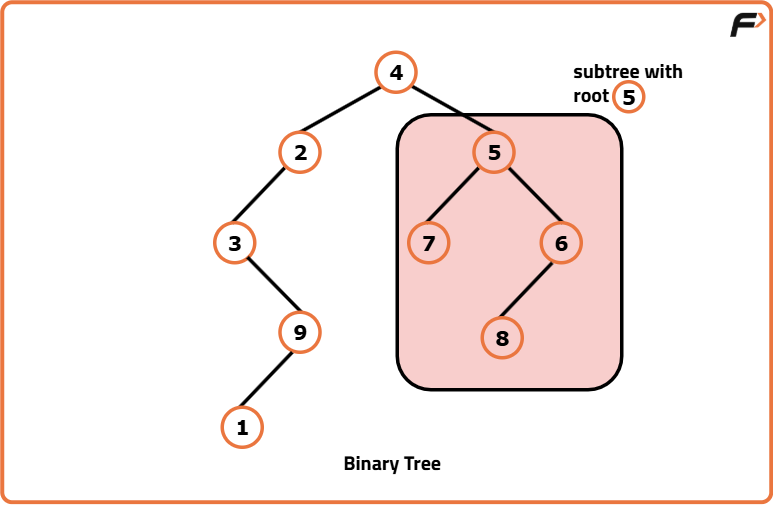

---

## Children Nodes

Children nodes are directly connected to a parent node. In a binary tree, a parent node may have:

- Zero children
- One child
- Two children

Each child is positioned either to the left or right of the parent node.

---

## Leaf Nodes

Leaf nodes are nodes that **do not have any children**. They lie at the outermost ends of the tree branches and represent the terminal points of traversal.

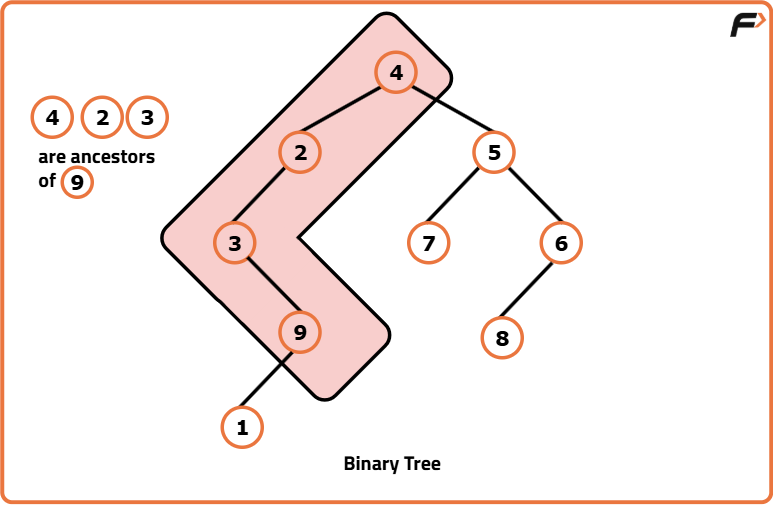

---

## Ancestors

Ancestors of a node are all the nodes encountered while moving upward from that node to the root through its parent nodes.

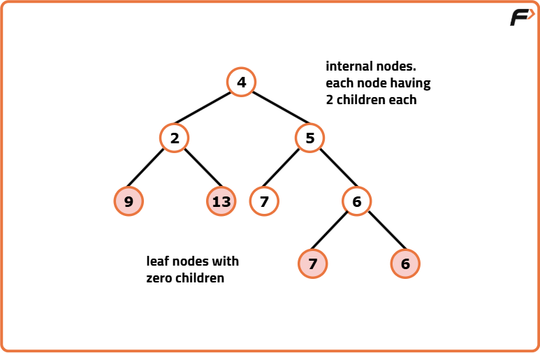

---

# Full Binary Tree

A **Full Binary Tree**, also known as a **Strict Binary Tree**, is a binary tree where every node has either:

- Exactly **two children**, or
- **No children**

No node has only one child.

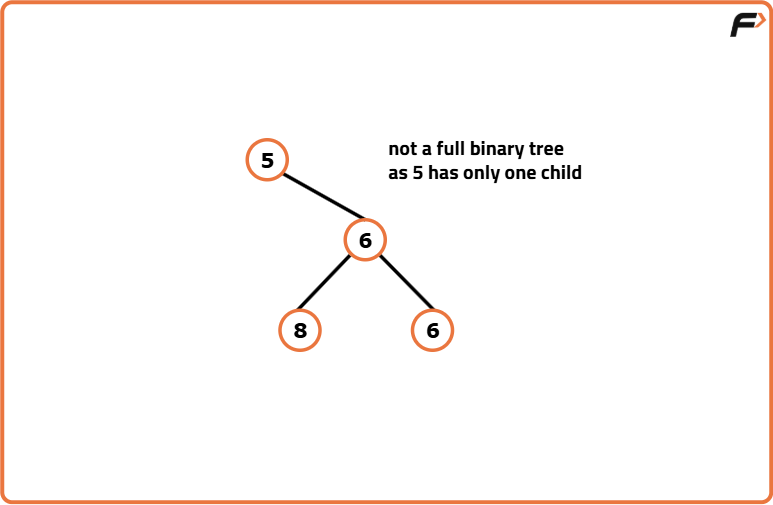

## Properties

- Every internal node has exactly two children.
- Every leaf node has no children.
- Produces a well-balanced structure.
- Traversal and insertion become more predictable.
- Better utilization of tree space.

---

# Complete Binary Tree

A **Complete Binary Tree** is a binary tree where:

- Every level is completely filled except possibly the last level.
- The last level is filled **from left to right**.

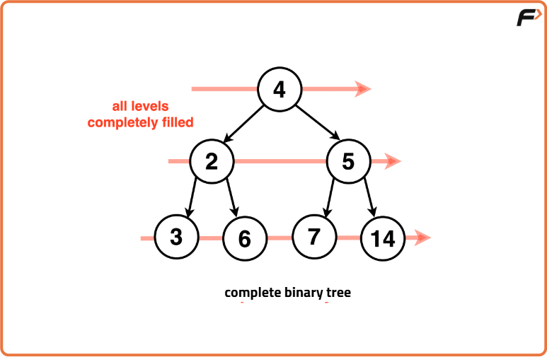

## Characteristics

- All levels except the last are completely filled.
- The last level is filled from left to right.
- Leaf nodes appear only in the last or second-last level.

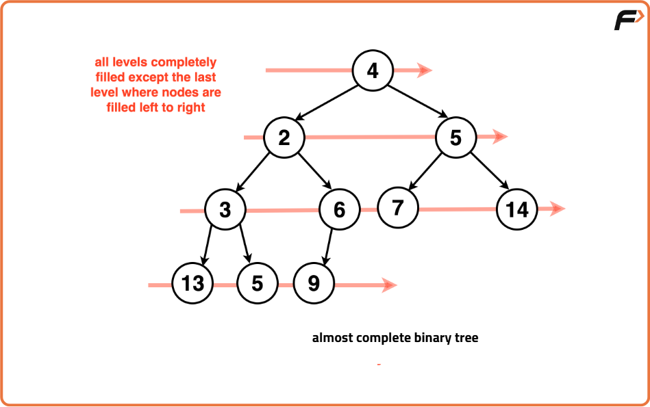

## Applications

Complete binary trees are widely used in:

- Binary Heaps
- Priority Queues
- Heap Sort

Their structure makes insertion, deletion, and retrieval operations efficient.

Although a complete binary tree may look similar to a full binary tree, it **does not require every node to have exactly two children**. The emphasis is on how nodes are positioned.

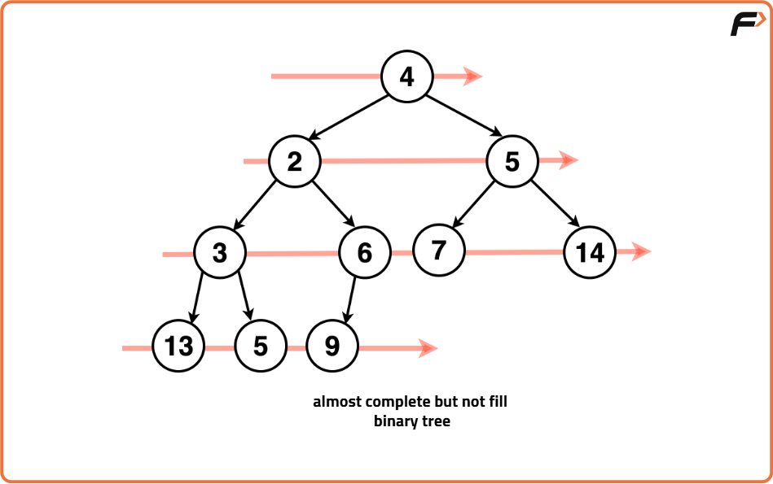

---

# Perfect Binary Tree

A **Perfect Binary Tree** is a binary tree in which:

- Every internal node has exactly two children.
- All leaf nodes are at the same level.
- Every level is completely filled.

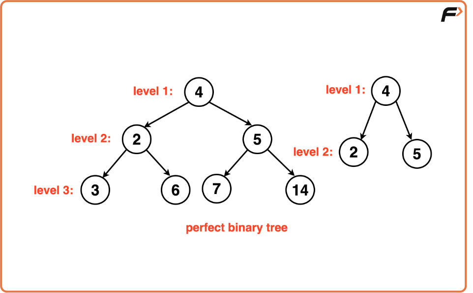

## Properties

- Maximum possible number of nodes for a given height.
- Perfectly balanced.
- Number of nodes doubles at each level.
- Efficient for searching and sorting operations.

Maintaining a perfect binary tree is often difficult in practical applications because insertions and deletions disturb its perfect structure.

---

# Balanced Binary Tree

A **Balanced Binary Tree** is a binary tree where the heights of the left and right subtrees of every node differ by **at most one**.

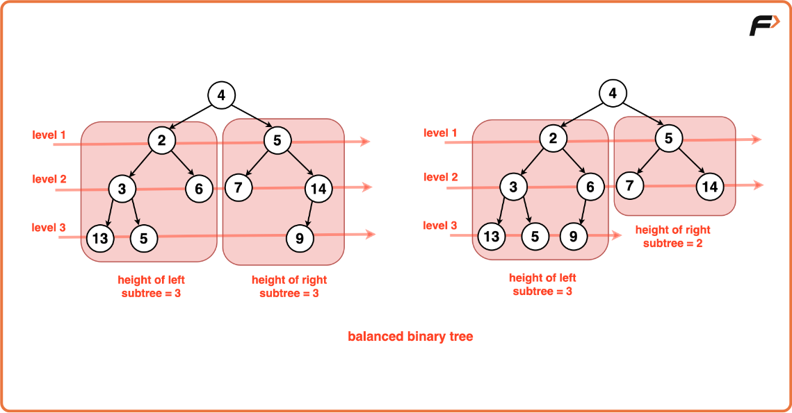

## Characteristics

- Tree height remains approximately **log₂(N)**.
- Prevents the tree from becoming heavily skewed.
- Ensures efficient searching, insertion, and deletion.

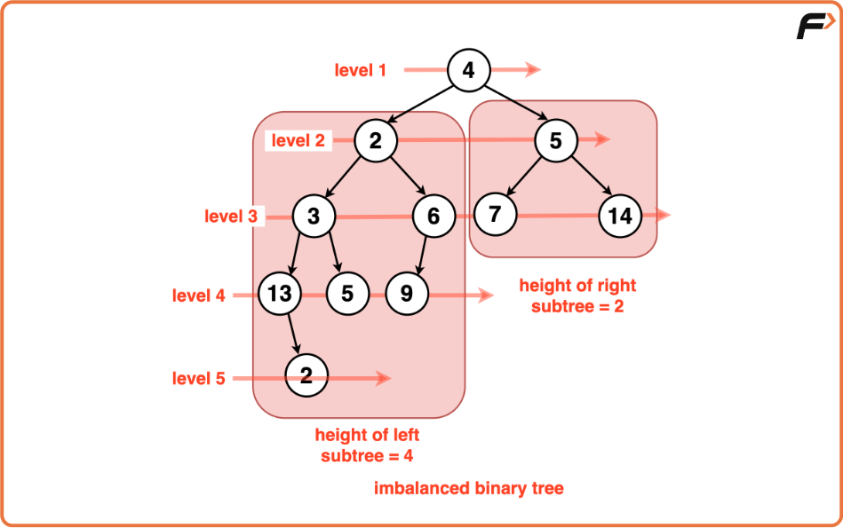

---

# Degenerate Tree

A **Degenerate Tree** is a binary tree in which every parent node has only one child.

The structure resembles a **linked list**, with nodes arranged in a single path.

## Characteristics

- Each level contains only one node.
- Tree height becomes equal to the number of nodes (**N**).
- Search operations degrade to **O(N)**.
- Commonly occurs when nodes are inserted in sorted order without balancing.

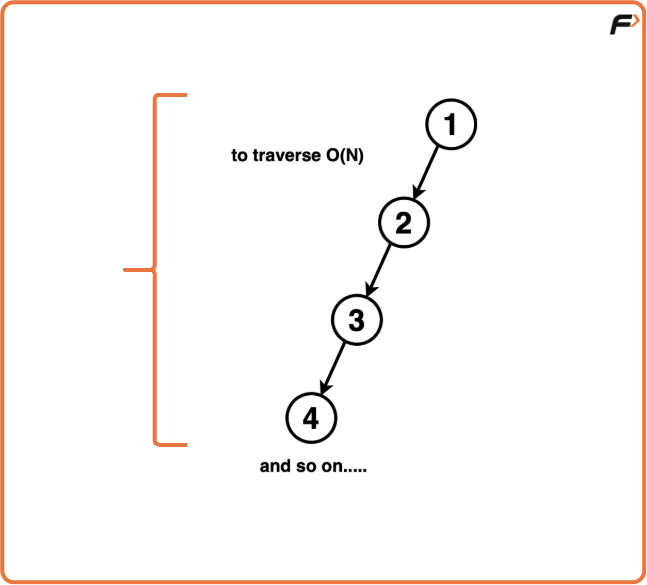

Understanding degenerate trees is important because they represent the **worst-case scenario** for binary tree operations.

---

# Summary

Binary Trees introduce a hierarchical way of organizing data compared to linear data structures.

Key points:

- Each node can have **at most two children**.
- Binary trees resemble the hierarchical structure of a computer file system.
- **Full Binary Trees** require every node to have either **0 or 2 children**.
- **Complete Binary Trees** have every level filled except possibly the last, which is filled from **left to right**.
- **Perfect Binary Trees** have all levels completely filled, with every leaf node at the same depth.
- **Balanced Binary Trees** maintain nearly equal subtree heights to ensure efficient operations.
- **Degenerate Trees** resemble linked lists and result in poor search performance.

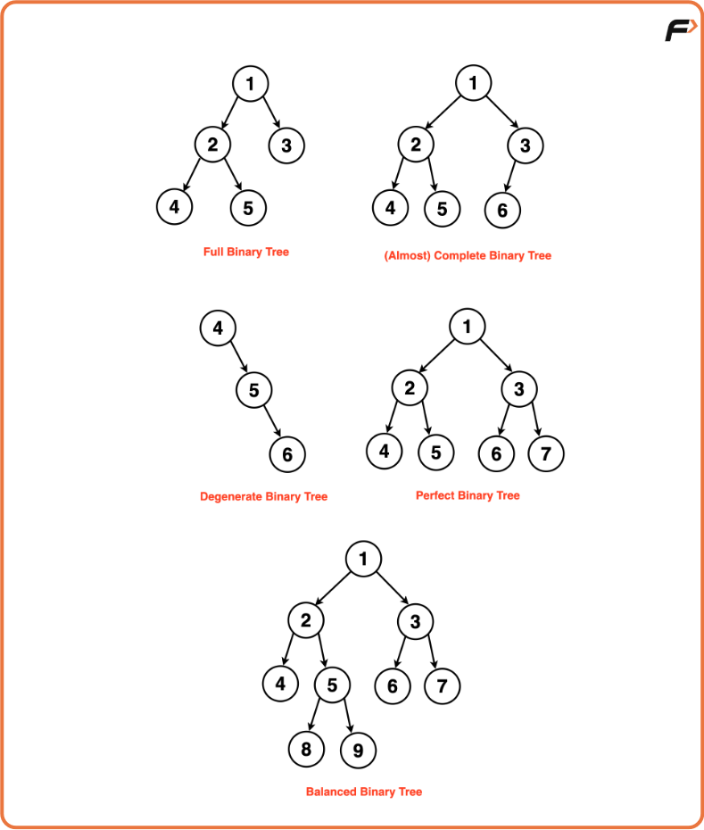